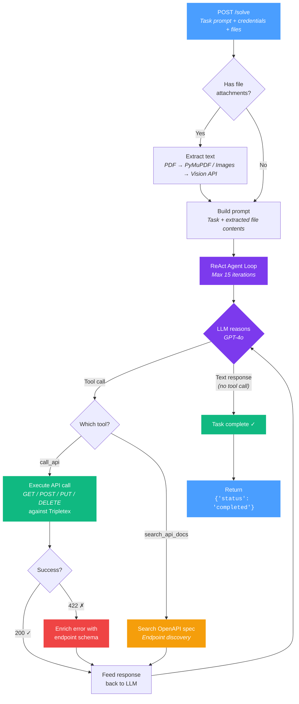

# Tripletex AI Agent

### NM i AI 2026 — Norwegian National Championship in AI

> An AI agent that completes accounting tasks in [Tripletex](https://tripletex.no) by reading task prompts in 7 languages and making the necessary API calls.

---

## The Competition

**NM i AI** (Norgesmesterskapet i AI) is Norway's national AI championship. The 2026 Tripletex challenge: build an agent that completes accounting tasks — creating customers, registering employees, issuing invoices, recording payments — via the Tripletex API.

- **30 task types** across 56 variants (7 languages × 8 data sets)
- **5-minute timeout** per task
- Tasks arrive in Norwegian Bokmål, Nynorsk, English, Spanish, Portuguese, German, and French
- The agent decides which API calls to make, in what order, with what data

---

## How It Works

The agent uses a **ReAct (Reason-Act-Observe)** loop: decide on an action, execute it, observe the result, repeat.



### The Two Tools

The LLM has exactly two tools at its disposal:

| Tool | Purpose |
|------|---------|
| `call_api` | Make HTTP requests (GET/POST/PUT/DELETE) to the Tripletex API |
| `search_api_docs` | Search the Tripletex OpenAPI spec to discover endpoints and required fields |

The LLM decides which endpoints to call, what data to send, and how to recover from errors.

---

## Examples

Simple task — create a customer from a Norwegian prompt:

```
"Opprett en kunde med navn Fjord Solutions AS,
 organisasjonsnummer 987654321,
 adresse Storgata 15, 3015 Drammen"
```

→ POST `/v2/customer` with structured address object

Multi-step task — register a payment:

```
"Register a payment for invoice #42 — full amount, paid today"
```

→ GET customer → GET invoices (with date range) → GET payment types → PUT payment with query params

---

## Tech Stack

| Component | Technology |
|-----------|-----------|
| Web Framework | FastAPI + Uvicorn |
| LLM | OpenAI GPT-4o (function calling) |
| API Client | requests (sync) |
| PDF Processing | PyMuPDF + OpenAI Vision API |
| Deployment | Docker → Google Cloud Run |
| Testing | pytest (107 unit/integration + e2e) |

---

## Project Structure

```
tripletex-agent/
├── src/
│   ├── main.py              # FastAPI app, /solve endpoint
│   ├── orchestrator.py       # Coordinates file processing → agent
│   ├── agent.py              # ReAct loop — the brain
│   ├── api_docs.py           # OpenAPI spec search tool
│   ├── tripletex_client.py   # HTTP client for Tripletex API
│   ├── file_processor.py     # PDF/image text extraction
│   ├── models.py             # Pydantic request/response models
│   ├── config.py             # Environment configuration
│   └── logging_config.py     # Structured JSON logging
├── tests/
│   ├── test_*.py             # Unit & integration tests
│   └── e2e/                  # End-to-end tests against sandbox
├── Dockerfile
└── CLAUDE.md
```

---

## Running Locally

```bash
# Install dependencies
pip install -e ".[dev]"

# Set your OpenAI API key
export OPENAI_API_KEY=sk-...

# Start the server
uvicorn src.main:app --port 8080

# Run tests
python3 -m pytest --tb=short
```

---

## Deployment

Deployed as a serverless container on Google Cloud Run:

```bash
gcloud run deploy tripletex-agent \
  --source . \
  --region europe-north1 \
  --allow-unauthenticated \
  --memory 512Mi \
  --timeout 300 \
  --port 8080
```

---

## Architecture Decisions

**Why ReAct over plan-then-execute?** Earlier versions generated a full plan upfront, then executed it blindly. This failed when the API returned unexpected validation errors or when tasks required dynamic lookups (e.g., finding a customer ID by organization number before creating a project). The ReAct loop lets the agent adapt on every step.

**Why only 2 tools?** Simplicity. The LLM is remarkably good at figuring out multi-step workflows when given just `call_api` and `search_api_docs`. More tools would mean more confusion in the prompt, more edge cases, and slower iteration.

**Why limit doc searches to 2 per task?** Production logs showed the agent sometimes spiraling into 9+ consecutive doc searches instead of just trying an API call. Capping at 2 forces it to rely on its built-in knowledge of common endpoints and only search when truly stuck.

**Why auto-generate the system prompt from the OpenAPI spec?** Earlier versions had hand-written endpoint docs in the prompt that drifted from reality — e.g., claiming `POST /v2/invoice` takes `orderId` in the body when the real endpoint is `PUT /v2/order/{id}/:invoice` with query params. Now, field names are extracted from the live spec at startup, required markers come from a curated registry validated by tests, and 422 error hints include real schema fields. The spec is the single source of truth; the prompt just presents it.

---

*Built for [NM i AI 2026](https://ainm.no).*
